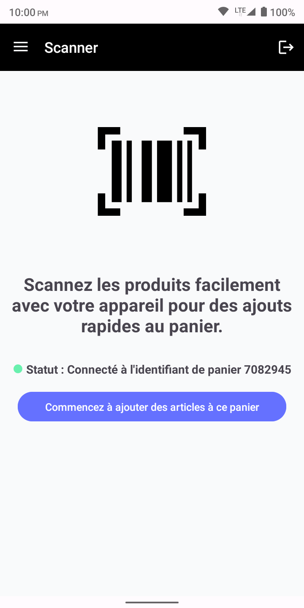
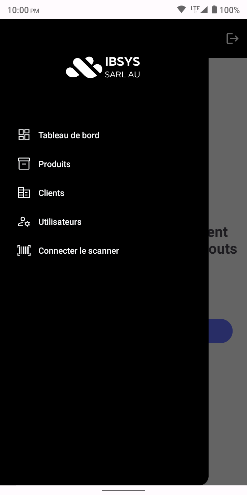

# Retail Manager Mobile App

## Overview

The Retail Manager Mobile App is an Android application designed to interact with the Retail Manager REST API. It enables retail managers to manage products, categories, customers, invoices, and more, directly from their mobile devices. The app integrates seamlessly with the backend API, providing a smooth user experience with features such as JWT authentication, product management, invoice creation, and customer tracking.

This project is part of a larger retail management system that also includes a **web client** and a **REST API**. For more details on the backend, visit the [Retail Manager REST API repository](https://github.com/youssef-faik/retail-manager-rest-api).

## Key Features

- Secure JWT authentication for user login
- Manage products, categories, and customers
- Create and manage invoices
- View sales and order data on a dashboard
- Real-time updates for invoice creation and management
- Responsive design for mobile use

## Prerequisites

- **Android Studio** (For development)
- **Java 17** (For compiling the application)
- **JWT Authentication** (For secure login)
- **Retail Manager REST API** (Backend)
- **Internet connection** (For API communication)

## Installation

1. Clone the repository:
   ```bash
   git clone https://github.com/youssef-faik/retail-manager-mobile-app.git
   cd retail-manager-mobile-app
   ```

2. Open the project in **Android Studio**.

3. Set up **API base URL** (for local or production environments):
    - In `Constants.java`, set the `BASE_URL` to the appropriate API URL (e.g., `http://localhost:8080` for local development).

4. Build and run the app on an emulator or physical device:
    - Click **Run** in Android Studio.

## Authentication

The app uses JWT for secure authentication. On first login, the user must provide credentials to obtain a JWT token. The token is then used for subsequent API requests.

### Login Screen
- Enter username and password to authenticate.
- Upon successful login, the user is redirected to the main dashboard.

## API Endpoints Integration

The mobile app interacts with the following API endpoints from the Retail Manager REST API:

### Authentication
- **POST /api/v1/auth/login**: Authenticate and retrieve a JWT token for subsequent requests.

### Products
- **GET /api/v1/products**: Display all products.
- **GET /api/v1/products/{id}**: View details of a specific product.

### Categories
- **GET /api/v1/categories**: Retrieve all product categories.

### Customers
- **GET /api/v1/customers**: Display all customers.
- **GET /api/v1/customers/{ice}**: View customer details by ICE.

### Invoices
- **POST /api/v1/invoices**: Create a new invoice.
- **GET /api/v1/invoices/{id}**: View an invoice's details.
- **GET /api/v1/invoices/{id}/pdf**: Retrieve a PDF version of the invoice.

### Dashboard
- **GET /api/v1/dashboard/sales**: Retrieve sales data within a given period.
- **GET /api/v1/dashboard/orders**: Retrieve order data within a given period.

## UI Screenshots

Here are some screenshots of the app's user interface:

### Login Screen


### Dashboard


### Product List


### Scan Products to Add to Cart


### Menu



## Security Configuration

JWT tokens are used for secure authentication. Ensure that you store your JWT token securely within the app to prevent unauthorized access.

## Contributions

Contributions are welcome! To contribute, please fork the repository, make changes, and submit a pull request.


---

Made with ❤️ by [Youssef Faik](https://github.com/youssef-faik)